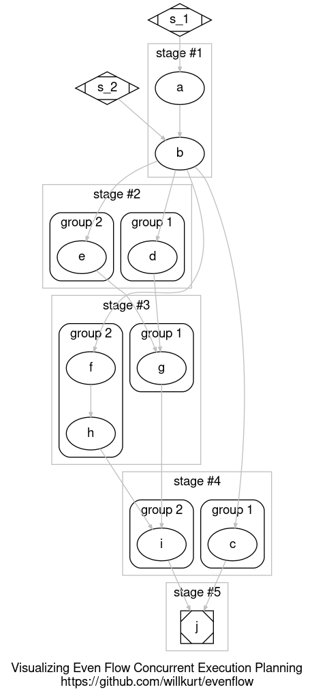

# Even Flow: Creating Self-Organizing, Automatically Concurrent Python Agents

"... thoughts arrive like butterflies."

Even Flow is an attempt to create a framework for *self-organizing* python functions composed from a set of functions with clearly defined inputs and a single output. Part of this self-organization is planning of current execution. The programmer only has to concern themselves with defining tiny pieces of a larger program and `evenflow` will automatically compose that program in the form of another `flowable` function.

The original intent of this package was to create a framework for the compostion of **LLM Agents** but it turned out it works for simple python functions as well. Nonetheless the intent is that `evenflow` can open up the possibliy of **self-organizing collections of AI agents** that are easy to define and modify.

## Usage

`evenflow` only uses two essential functions: 

- `flowable` a dectorator to annotate your functions
- `compose_flow` which takes a list of *flowable* functions and builds a new, also flowble, function.

Other than that you must ensure:
- all functions that are `flowable` return a value
- agrument names are used consistently across `flowable` functions.

To understand what this all means, let's look at a `flowable` "hello world" function.

## Example 1: Hello World

In this example we'll create a function that will print "Hello <name> from the <department> dept!" from an email address. The email address can be used to look up the `name` and `department` seperately. This, of course, is a toy problem, but it is meant to be similar to a common pattern that comes up when using Retrieval Augmented Generation (RAG) working with LLM agents.

Let's start by thinking about our program from a top-down perspective, something that is made very easy by `evenflow`. We know in the end we want to take two inputs and return an output. Here is our base function which uses the `flowable` decorator:

```python
from evenflow import flowable, compose_flow

@flowable('hello_statement')
def say_hello(name, department):
    return f"Hello {name} from the {department} dept!"
```
Names are important for `evenflow`, in our decorator we will specify the return value of our flowable function. This name can should match the parameters taken by other functions that use this output. It's okay if they haven't been defined yet!

Next let's build a simple function that looks up a name based on a email address:

```python
@flowable('name')
def lookup_name(email):
    name_dict = {
        "will@countbayesie.com": "Will Kurt",
        "emil@notreal.xyz": "Emil Cioran",
        "sogol@daumal.net": "Professor Sogol"
    }
    return name_dict.get(email,"unknown")
```

When creating a `flowable` function the only thing the programmer needs to worry about is being consistent with names of inputs (parameters) and output (argument to `flowable`).

Next we'll build a similar function for looking up department:

```python
@flowable('department')
def lookup_department(email):
    dept_dict = {
        "will@countbayesie.com": "English",
        "emil@notreal.xyz": "Philosophy",
        "sogol@daumal.net": "Logic"
    }
    return dept_dict.get(email,"unknown")
```

Now we need only one other function, `compose_flow`, to put this all together to make a `hello_world` function. `compose_flow` just takes in a list of `flowable` functions you want to use as building blocks and then it *automatically assembles them into another, flowable, function*. The order in the list *does not matter* since `evenflow` figures out the necessary order for you.

```python
hello_world = compose_flow([say_hello, lookup_name, lookup_department])
```

We now have a regular Python function, self-assembled from flowable parts:

```python
hello_world("will@countbayesie.com")

# 'Hello Will Kurt from the English dept!'
```

When building complex systems of interacting agents (or really just functions) it can be hard to imagine the *entire system*, but often easy to know what inputs you want at each stage. `evenflow` makes buiding complex, agent based systems easier by leaving you to only worry about the inputs and outputs at each section.

## Robustness to incomplete functions

This may seem interesting, but haven't we just pushed off the problem of organizing our code with doing a bunch of book keeping about what value we need to build the function?

Part of the aim of creating self-organizing functions is that they are *robust to missing functions*. To understand this better let's take a look at this `hello_world` function we've created:

```python
hello_world
# <function evenflow.compose.compute_hello_statement(email)>
```

As you can see it's a real function that takes a named argument `email` just like a normal function. But what happens if we forgot (or were unable) to implement `lookup_department`? Let's implement an incomplete version of `hello_world`

```
hello_world_incomplete = compose_flow([say_hello, lookup_name])
hello_world_incomplete
# <function evenflow.compose.compute_hello_statement(email, department)>
```

You see it's no problem at all! `evenflow` is able to figure out which inputs are missing and simply require them as parameters to the generated function. For now we can manually pass in the `department`:

```python
hello_world_incomplete('emil@notreal.xyz',"philosophy")

# 'Hello Emil Cioran from the philosophy dept!'
```

Not bad, but what if we realize this problem and want to fix this? We could simply add the correct function to the list, but it's very possible we don't have access to the original list. What if that list is part of another library we imported our `hello_world_incomplete` from? There's another solution: every `evenflow` function created by `compose_flow` is also `flowable` by it's nature. So, if we can't modify the original list of component, we can still add this behavior in:

```python
hello_world_fixed = compose_flow([hello_world_incomplete, lookup_department])
hello_world_fixed("sogol@daumal.net")
# 'Hello Professor Sogol from the Logic dept!'
```

While our example here is quite trivial, it's not hard to imagine a more complicated scenerio: replace our `say_hello` with a function that calls an LLM, and our `lookup_*` functions with seperate calls to databases passing information need for RAG `say_hello`. This would describe a simple RAG system while at the same time could be trivially implemented and expanded in Python. This simple example has shown that this lightweight framework is extremely extensable and requires little more from the programmer than mild annotations.

## How Even Flow works

Under the hood `evenflow` is building a **directect acyclic graph** (DAG) of functions and then performing a *planning* step which organizes them into **stages** each of which is made up of *concurrently executable* **groups**.

### Flowable functions

The `flowable` decorator adds some internal annotations to our functions so it's trivial to treat them like nodes in a graph. The annotations don't change the fundamental behavior of the functions, so you can still use them anywhere you might want in a regular Python program.

### Building the DAG

Here is an example collection of functions that we want to compose. These function don't do anything, they are just to demonstrate the dependencies created.

```python
""" Map of the dependency DAG
        S_1  S_2
         |    |
         A    |
          \  /
         _ B
       /  /|\ 
      C  D E F
      |  | | |
      |  \ / |    
      |   G  H
       \   \ |
        \   I
         \  |
           J
"""
    @flowable('a')
    def a(s_1):
        return 'a'
    @flowable('b')
    def b(a,s_2):
        return 'b'
    @flowable('c')
    def c(b):
        return 'c'
    @flowable('d')
    def d(b):
        return 'd'
    @flowable('e')
    def e(b):
        return 'e'
    @flowable('f')
    def f(b):
        return 'f'
    @flowable('g')
    def g(d,e):
        return 'g'
    @flowable('h')
    def h(f):
        return 'h'
    @flowable('i')
    def i(g, h):
        return 'i'
    @flowable('j')
    def j(c,i):
        return 'j'
    components = [d,e,f,a,b,c,g,h,i,j]
```

The image in the comment above lays out the DAG implied by the dependency among functions. It's important to note that the *programmer* of `evenflow` does not have to worry themselves with the construction of this DAG.

Internally `evenflow` performs a *topological sort* of the nodes. The function that performs this internally is `evenflow.compose.flow_topo_sort`. In our example the components are intentionally mixed up, here we can see that `flow_topo_sort` rearranges these in the necessary order of execution (this is, by definition, what a topological sort does):

```python
> flow_topo_sort(components)
[<function evenflow.base.a(s_1)>,
 <function evenflow.base.b(a, s_2)>,
 <function evenflow.base.d(b)>,
 <function evenflow.base.e(b)>,
 <function evenflow.base.f(b)>,
 <function evenflow.base.c(b)>,
 <function evenflow.base.g(d, e)>,
 <function evenflow.base.h(f)>,
 <function evenflow.base.i(g, h)>,
 <function evenflow.base.j(c, i)>]

```

Now that they are in order we just have to execute these.

### Sequential Execution

Once the nodes have been sorted in topological order, then `evenflow` just has to manage passing a collection of shared arguments from the nodes in order. Wrapping all of this behavior in a dynamically defined function which is returned to the user after calling `compose_flow` makes it easy to work with this DAG as though it were an ordinary function.

### Concurrent Execution

The real magic of `evenflow` is not building the DAG, but planning the execution of the DAG so that it can be run concurrently. The DAG is broken down into *stages*, each stage is further broken down into 1 or more *groups*. Each group in a stage is *independant* of the others can so can be run concurrently.



Once `evenflow` has planned the execution stages it then uses a `ThreadPoolExecutor` to allow concurrency via Python's threads. The choice of using threads was to free the `evenflow` programmer from having to think about their programs concurrently. Just build out the piece you need and even flow will take care of the rest.

The idea is that by focusing only on the individual tasks agents (or functions for that matter) perform, very complex systems can be designed from simple, easy to understand and debug, components.